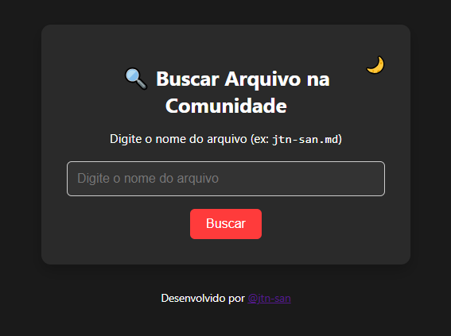

# 🔍 Buscar Repositório da Comunidade

Uma página simples e elegante para acessar diretamente os arquivos da comunidade do repositório [DIO Lab Open Source](https://github.com/digitalinnovationone/dio-lab-open-source).



---

## 🚀 O que é?

Este projeto permite que qualquer pessoa busque rapidamente arquivos `.md` dentro da pasta `community` do repositório principal da DIO, apenas digitando o nome do usuário/arquivo.

👉 **Acesse a versão online:**  
[https://jtn-san.github.io/buscarRepositorioCommunity/](https://jtn-san.github.io/buscarRepositorioCommunity/)

---

## 💡 Como usar

1. Acesse a página.
2. Digite o nome do arquivo `.md` correspondente ao usuário (exemplo: `jtn-san.md`).
3. Clique em **"Buscar"**.
4. O link abrirá diretamente no GitHub no arquivo correspondente.

---

## 🌓 Tema claro e escuro

- Tema escuro por padrão 🌙
- Clique no botão no canto superior direito do card para alternar entre claro ☀️ e escuro 🌙

---

## 🛠️ Tecnologias utilizadas

- HTML5
- CSS3 (com modo light/dark e responsividade)
- JavaScript puro (sem frameworks)

---

## 📁 Estrutura do projeto

```
📦 buscarRepositorioCommunity
 ┣ 📄 index.html
 ┣ 📄 style.css
 ┣ 📄 README.md
 ┗ 📁 docs
    ┗ 📸 preview.png
```

---

## ✨ Contribuições

Sinta-se à vontade para contribuir com melhorias, estilos, animações ou traduções!

---

## 👤 Autor

Feito com ❤️ por [@jtn-san](https://github.com/jtn-san)

---

## 📄 Licença

MIT License
